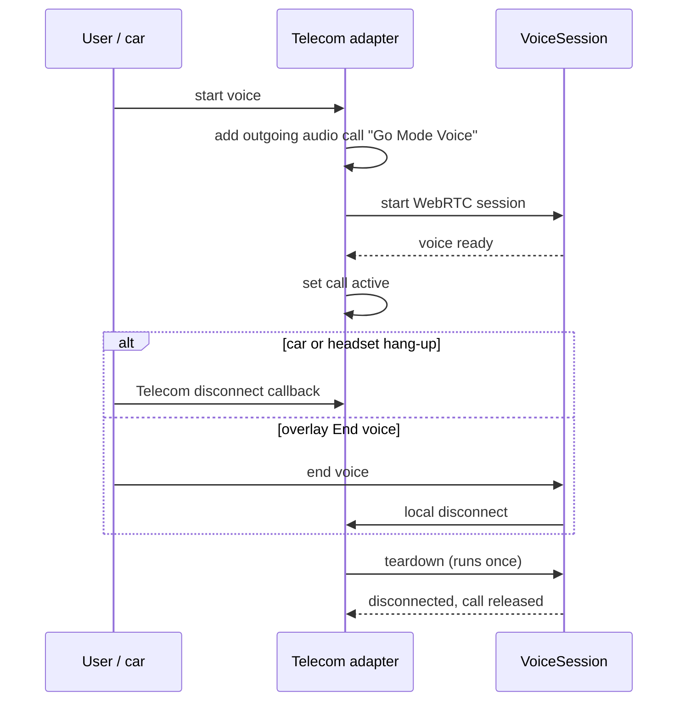

# Car HFP Call Control

Go Mode voice sessions register with Android Telecom as self-managed audio
calls. A car or headset hang-up then requests a Telecom disconnect. Go Mode does
not infer hang-up from Bluetooth SCO teardown. Phases:
[PLAN_GOMODE.md](PLAN_GOMODE.md).

## Decision

Use AndroidX Core-Telecom (`androidx.core:core-telecom`) for every active voice
session. It wraps the legacy `ConnectionService` path and the newer
transactional APIs, and supports `minSdk = 33`. Go Mode keeps its voice overlay
and does not become the default dialer. Android provides Bluetooth HFP,
automotive, audio-route, and call-concurrency integration.

`MediaSession` and SCO broadcasts are not the hang-up mechanism. They report
media buttons and audio routing, not HFP call control.

## Call Lifecycle

One teardown owner serves the overlay and Telecom, so duplicate or late
callbacks are harmless. A user hang-up is a local disconnect. A WebRTC or server
failure is a remote or error disconnect.

## Telecom Adapter

The adapter owns `CallsManager`, registration, one active `CallControlScope`,
and the mapping from Telecom callbacks to the voice lifecycle.

- Register capabilities during app setup, never during a call.
- Declare `MANAGE_OWN_CALLS`.
- Add an outgoing audio-only call with non-sensitive display metadata and an
  app-owned URI scheme.
- Expose four operations to `VoiceSession`: start the call, set it active, end
  it locally, and react to a Telecom disconnect.
- Show a rejected or unavailable Telecom call as a voice setup error.

## VoiceSession

`VoiceSession` keeps the WebRTC gateway, transcript, and MCP tools. Once
Telecom owns the call, SCO loss is not a hang-up.

- Start the Telecom call before or with WebRTC setup.
- Set the call active after the voice data channel is ready.
- On a Telecom disconnect, run the teardown and report completion.
- On an overlay disconnect, request a local Telecom disconnect.
- Treat WebRTC errors as call failure. Recovery runs only while the call is
  active.

## Audio Routing

Telecom owns communication routing and concurrency for an active call. The
endpoint picker uses Core-Telecom endpoints instead of
`AudioManager.setCommunicationDevice()`. The current `AudioDeviceCallback` and
SCO receiver in `VoiceSession.kt` stay only as diagnostics and as the fallback
for devices without `PackageManager.FEATURE_TELECOM`. They never end a
Telecom-managed call, and the fallback does not promise car hang-up.

There is no hold. When Telecom yields to a cellular or VoIP call, Go Mode voice
disconnects.

## Verification

Unit tests use a fake adapter at the Telecom boundary and cover: setup success,
Telecom rejection, car disconnect, overlay disconnect, WebRTC failure, and
duplicate disconnect callbacks. Do not simulate a car with Bluetooth broadcasts.

HFP implementations vary, and an emulator cannot validate them. On a Bluetooth
headset and the target car head unit:

1. Start voice. The device shows a Go Mode call.
2. Press hang-up. WebRTC, microphone, foreground call state, and overlay end.
3. End voice from the overlay. The remote call UI clears.
4. Switch between car Bluetooth, speaker, and wired or USB endpoints during
   voice.
5. Receive or place a cellular call during voice. Voice disconnects.

Capture `GoModeVoiceSession`, Telecom, and Bluetooth logs for failures.

## References

- [Core-Telecom guide](https://developer.android.com/develop/connectivity/telecom/voip-app/telecom)
- [CallsManager](https://developer.android.com/reference/androidx/core/telecom/CallsManager)
- [ConnectionService](https://developer.android.com/reference/android/telecom/ConnectionService)
- [Audio Manager self-managed call guide](https://developer.android.com/develop/connectivity/bluetooth/ble-audio/audio-manager)
