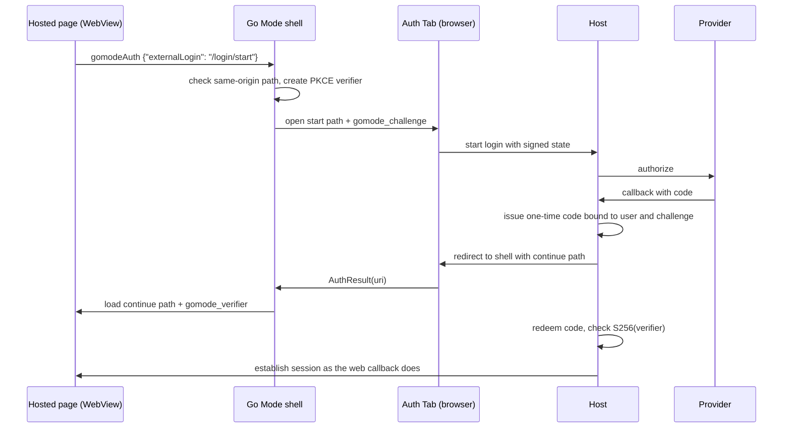

# Native Login Handoff

The Android shell runs provider login in the user's browser through an Auth
Tab, then hands the resulting host session to the WebView with a one-time code.
Phases: [PLAN_NATIVE_LOGIN.md](PLAN_NATIVE_LOGIN.md).

## Decision

Provider login does not run in the WebView:

- Google rejects embedded WebViews with `disallowed_useragent`, which also
  breaks "Continue with Google" on GitHub.
- The WebView has its own cookie jar, so the user has no provider session.
- `WEB_AUTHENTICATION_SUPPORT_FOR_APP` allows WebAuthn only for origins linked
  to the app through Digital Asset Links, so provider passkeys fail.
- RFC 8252 §8.12: native apps "MUST NOT use embedded user-agents to perform
  authorization requests."

AndroidX Browser `AuthTabIntent` opens the login in the default browser, with
its sessions, passkeys, and password manager, and returns the redirect as an
activity result. Browsers without Auth Tab support (Chrome before 137) open a
Custom Tab, and the redirect arrives as an intent.

## Flow

## Contract

**Shell capability.** `window.goModeHost.supportsExternalLogin()` returns
true. A page that sees no such capability keeps its web login.

**Start.** The page posts `{"externalLogin": "<path>"}` on `gomodeAuth`. The
shell accepts only an absolute path on the active service origin. It adds
`gomode_challenge`, the base64url SHA-256 of a fresh 32-byte verifier, and opens
the URL in an Auth Tab.

**Host redirect.** When the start request carries `gomode_challenge`, the host
completes provider login, then issues a one-time code bound to the user and the
challenge. The code expires after 2 minutes. The host redirects to the shell
redirect URI with `continue`, a same-origin absolute path that carries the code.

**Exchange.** The shell checks that `continue` is a same-origin absolute path,
adds `gomode_verifier`, and loads it in the WebView. The host redeems the code
once, checks the verifier against the challenge, and then establishes the
session exactly as its web callback does: a cookie, a bearer through
`gomodeAuth`, or both.

## Security

- The code is worthless without the verifier, and the verifier never leaves
  the shell before the exchange on the service origin.
- A code redeems once, expires fast, and binds to one challenge.
- The host never puts a session token in a redirect URL.
- Provider state stays HMAC-signed and cookie-bound on the host
  (`oauth/oauthserver` `SignState` and `ValidateState`).

## Open Question: redirect form

An https redirect is verified: Auth Tab returns `RESULT_VERIFICATION_FAILED`
unless the redirect host and the app share Digital Asset Links. A Go Mode host
can serve `/.well-known/assetlinks.json` for `com.fghbuild.gomode`, but
self-hosted domains are unknown to the app manifest. If runtime verification
works without a manifest entry, use https. Otherwise use the private-use scheme
`com.fghbuild.gomode:/auth`. Any app can claim that scheme and run its own flow
with its own challenge, so the host then shows a confirmation page that names
the account and the Go Mode app before it redirects.
