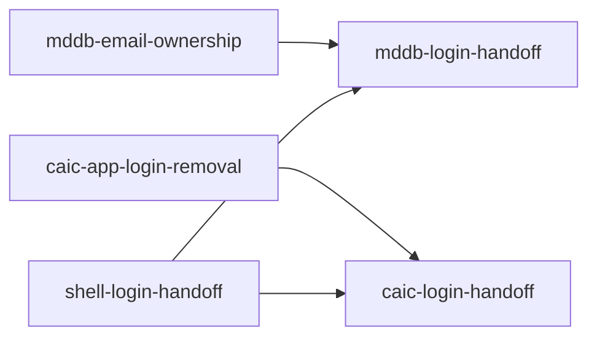

# Go Mode users sign in with any provider through their browser

mddb grants accounts only to proven email addresses, caic stops leaking
session tokens in URLs, and the Android shell signs in to caic and mddb through
an Auth Tab. Design: [NATIVE_LOGIN.md](NATIVE_LOGIN.md).

## Phase 1 — mddb-email-ownership: Grant nothing to an unproven address

- **Scope:** Password registration claims any address without proving it.
  Such an account captures invitations to the address, because acceptance
  resolves the invitee with `GetByEmail` and returns a JWT for that account.
  When the real owner later signs in with a verified provider email, the
  identity attaches to that account and the squatter's password keeps working.
- **Preserve:** Deployments without SMTP can still register and sign in.
- **Verify:** Handler tests show that an unverified account neither receives
  an email-addressed invitation nor gains a verified provider identity while
  its unproven password stays valid, and that invitation acceptance never
  returns a session for an account that did not prove the address.

## Phase 2 — caic-app-login-removal: Stop putting caic JWTs in custom-scheme URLs

- **Depends on:** none
- **Scope:** Delete `return=app` login and its `caic://auth?token=` redirect. No
  client in caic or gomode uses it, and Go Mode does not register `caic://`.
- **Verify:** `return=app` yields a 400, web login with `next` still works, and
  no `caic://auth` redirect remains.

## Phase 3 — shell-login-handoff: Hand a browser login to the WebView

- **Depends on:** none
- **Scope:** The contract in [NATIVE_LOGIN.md](NATIVE_LOGIN.md#contract): a Go
  one-time code store with S256 verification for hosts, the web host-mode
  capability check, the shell's `externalLogin` message and Auth Tab launch
  with Custom Tab fallback, and the standalone hosted fixture. Settle the
  [redirect form](NATIVE_LOGIN.md#open-question-redirect-form) first and
  update the design.
- **Preserve:** Shells and pages without the capability keep WebView login.
  The existing `gomodeAuth` messages keep their meaning.
- **Verify:** Go tests cover single use, expiry, and verifier mismatch. Shell
  tests reject cross-origin start and `continue` paths. `make android-e2e`
  completes a fixture login, and a device run completes it in Chrome 137+ (Auth
  Tab) and in a browser without Auth Tab (Custom Tab).

## Phase 4 — mddb-login-handoff: Sign in to mddb from the shell

- **Depends on:** mddb-email-ownership, shell-login-handoff, and a published
  Go Mode release
- **Scope:** mddb OAuth start and callback honor `gomode_challenge`, an
  exchange route redeems the code and establishes the session as the web
  callback does, and the login page sends `externalLogin` when the shell
  supports it.
- **Verify:** On a device, the shell signs in to mddb with GitHub and Google
  without typing a GitHub password when the browser holds a session. A replayed
  or verifier-less exchange fails.

## Phase 5 — caic-login-handoff: Sign in to caic from the shell

- **Depends on:** caic-app-login-removal, shell-login-handoff, and a published
  Go Mode release
- **Scope:** The same host changes for caic's GitHub, GitLab, and Google login;
  the exchange sets caic's session cookie.
- **Verify:** On a device, the shell signs in to caic with GitHub and Google. A
  replayed or verifier-less exchange fails.

## Later

- mddb shows OAuth callback errors as raw JSON; the login page ignores
  `oauth_error`.
- mddb OAuth identities stored before the verified-email rule keep their
  unverified emails, which git authorship still prefers.
- mddb's web callback delivers its JWT in `/?token=`, which lands in browser
  history.
