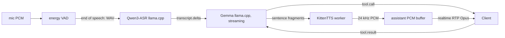

# Go Mode Local Voice Stack

The `local-stack` backend serves the unchanged
[voice gateway contract](VOICE_GATEWAY.md) with local ASR, LLM, and TTS. It is
half-duplex and needs no API key. It runs on macOS or Linux; macOS is the first
target. Target-Mac validation is phase `local-voice-quality` of
[PLAN_GOMODE.md](PLAN_GOMODE.md).

English-only speech models are acceptable for this stack. Multilingual support
is optional; language coverage alone must not rule out an ASR or TTS candidate.
Compare candidates on English quality, latency, memory use, and runtime
availability.

Noncommercial model licenses are acceptable for the owner's current usage.
Record each model's license in research comparisons; noncommercial terms alone
do not disqualify a candidate.

## Turn Flow



- ASR is final-only. After VAD end-of-speech, the adapter sends one in-memory
  WAV through `genai.Provider.GenSync` and emits one user transcript delta.
- Every LLM turn, including continuations after tool results, keeps tools
  available. `genai.Provider.GenStream` deltas go to TTS as stable sentence
  fragments. The final result drives history and tool calls.
- The fragmenter keeps text order, emits on stable punctuation or a size limit,
  and holds trailing text until the next boundary or the final flush.
- The selected TTS engine takes one request per fragment and streams PCM for
  each. Its 24 kHz mono S16LE output needs no resampling.
- Barge-in cancels the active turn and clears buffered assistant audio.
- `turn.status` reports `transcribing` at end of speech, `thinking` before
  generation, and `idle` when the turn ends. A turn superseded by newer speech
  reports nothing, so its late end cannot clear the newer turn's state.
- An interrupted turn keeps its user text: the next utterance joins it in one
  user message, since genai requires alternating roles.
- The bridge drains assistant PCM at realtime from an unbounded buffer, so TTS
  can queue audio ahead of playback.
- Logs report TTS first audio per fragment, buffer depth, and first assistant
  RTP latency. Runtime readiness is logged separately; latency figures exclude
  setup.

Partial ASR waits for a protocol flag that marks transcript deltas provisional
or final, and for a runtime with useful partial results.

## Configuration

```toml
backend = "local-stack"

# Omit these tables to let the gateway download and run its own llama.cpp
# servers. Set remote only when you run llama-server yourself, for example
# with custom flags, caches, thread counts, or builds.
# [local_stack.asr]
# provider = "llamacpp"
# remote = "http://localhost:8090"
# model = "ggml-org/Qwen3-ASR-0.6B-GGUF:Q8_0"

# To use an alternate ASR server, replace the table above with:
# [local_stack.asr]
# engine = "openai-audio" # or "whispercpp"
# remote = "http://127.0.0.1:8000"
# model = "mlx-community/parakeet-tdt-0.6b-v3" # omit for whispercpp

# [local_stack.llm]
# provider = "llamacpp"
# remote = "http://localhost:8080"
# model = "unsloth/gemma-4-E2B-it-GGUF:UD-Q4_K_XL"

# [local_stack.tts]
# engine = "openai-audio"
# remote = "http://127.0.0.1:8000"
# model = "mlx-community/Kokoro-82M-bf16"
# voice = "af_heart"
```

ASR and LLM each run in their own managed llama.cpp server with independent
lifetimes by default. ASR `engine = "genai"` uses the existing `provider` key
to select any registered genai provider. The default TTS is
`KittenML/kitten-tts-2` with the Jasper voice, started
through `uv` and Python 3.12. Set `local_stack.tts.model` and
`local_stack.tts.voice` to select a different KittenTTS model or voice. The gateway does not manage alternate servers;
start them before starting the gateway. `remote` is a server origin without a
path. Keep it on loopback to keep microphone audio and speech local.

### Remote chat completions LLM

The LLM can use a remote OpenAI-compatible chat completions endpoint while
ASR and TTS keep their local defaults. The remote model must support function
tools. For example, to use RunInfra:

```toml
[local_stack.llm]
provider = "openaicompatible"
remote = "https://api.runinfra.ai/v1/chat/completions"
model = "qwen3-8-27b"
api_key_name = "RUNINFRA_GATEWAY_KEY"
```

For this provider, `remote` is the complete endpoint URL, including its path.
`api_key_name` names an environment variable containing the bearer token;
omit it for an unauthenticated endpoint. A named variable must be nonempty
when the gateway starts. Credentials are confined to that endpoint; redirects
to a different URL fail. Supply the variable to the gateway process, including
its systemd service environment when running as a service. Keep the key out
of the TOML file.

Transcripts, the system instruction, and service-item context are sent to the
configured LLM endpoint.

For DeepSeek's native API, use the registered `deepseek` provider:

```toml
[local_stack.llm]
provider = "deepseek"
model = "deepseek-flash"
```

This provider uses its default API endpoint and reads `DEEPSEEK_API_KEY` from
the gateway process environment. Omit `remote` and `api_key_name`.

### Alternate speech engines

| Stage | Configuration | Server requirement | Host platform |
| --- | --- | --- | --- |
| ASR | `engine = "openai-audio"`, `remote`, `model` | `POST /v1/audio/transcriptions`, multipart WAV and model, JSON `text` | MLX Audio on Apple Silicon macOS; other compatible local servers on their supported hosts |
| ASR | `engine = "whispercpp"`, `remote` | whisper.cpp `POST /inference`, multipart WAV, JSON response | CPU on macOS, Linux, or Windows; CUDA builds on Linux or Windows |
| TTS | `engine = "openai-audio"`, `remote`, `model`, `voice` | `POST /v1/audio/speech` with `response_format = "pcm"` and `stream = true`; raw 24 kHz mono S16LE PCM response | MLX Audio on Apple Silicon macOS; other compatible local servers on their supported hosts |

For example, on Apple Silicon start an [MLX Audio API server](https://github.com/Blaizzy/mlx-audio/blob/main/docs/guides/web-ui-api-server.md)
with `mlx_audio.server --host 127.0.0.1 --port 8000`. Then configure both
`local_stack.asr` and `local_stack.tts` for `openai-audio`, using models and a
voice actually installed in that server. MLX Audio only runs on Apple Silicon.
On Linux or Windows, a [whisper.cpp server](https://github.com/ggml-org/whisper.cpp/blob/master/examples/server/README.md)
can provide ASR with a CPU or CUDA build. On those hosts, use KittenTTS or a
separately deployed speech server that meets the TTS wire and audio contract.
The gateway does not infer hardware capability from its own OS because the
configured server may run on another host. Alternate audio servers are not
pinged at gateway startup because their health and model readiness endpoints
are not shared across engines. Warm the selected models before a live session;
the first request can include model loading or download time.

ASR receives one completed 16 kHz utterance WAV and returns final text.
Responses are limited to 1 MiB; malformed or failed HTTP responses fail the
turn. TTS PCM is passed through without resampling, so selecting a server with
a different sample rate or format will produce incorrect playback. The gateway
cancels outstanding HTTP requests on barge-in. Check the configured model's
output sample rate before using it.

## KittenTTS Runtime

- The shared [`genaipy/kittentts`](https://github.com/maruel/genaipy/tree/main/kittentts)
  runtime owns the Python worker, package pin and model cache. The gateway
  retains voice session orchestration.
- The runtime pins the upstream KittenTTS revision and produces 24 kHz mono
  S16LE PCM. A cancelled synthesis request leaves the worker available for the
  next utterance; closing the gateway stops it.
- Python 3.13 fails to build transitive dependencies; use 3.12.
- The dependency graph can pull large ML packages. KittenTTS stays an external
  process with its caches under the user cache directory, not vendored code.
- Cold setup is slow and variable, dominated by llama.cpp startup and cache
  state.
- Unauthenticated Hugging Face downloads work but warn about rate limits. Set
  `HF_TOKEN` for reliable cold setup.

## Smoke Test

```sh
make test-smoke
```

The `smoke` build tag keeps these tests out of `make test` and CI;
`make verify` still lints them. Each test runs with its own `HOME` and XDG
directories, so it never reads or writes host configuration or caches, and
every run includes cold llama.cpp, uv, and KittenTTS setup. Only `HF_HOME`
stays on the host, defaulting to `~/.cache/huggingface`, so runs reuse
downloaded models. `TestSmokeVoiceRTCLocalAudio` checks TTS, ASR, LLM, managed
tool calls, and full WebRTC turns. `TestSmokeVoiceGatewayToolCall` serves the gateway HTTP API with
the default local stack, speaks "Set a timer for five minutes." over WebRTC,
answers the `set_timer` tool call, and closes the session through the API.
Linux CPU runs prove wiring and audio-path correctness only; latency and
quality need the target Mac. Do not measure RSS.

## Further alternatives

Evaluate these after measuring the target hardware:

- **ASR:** Parakeet through NeMo, `mudler/parakeet.cpp`, or ONNX. Gemma audio
  input is a fallback.
- **LLM:** MLX, or an OpenAI-compatible server such as vLLM or SGLang.
- **TTS:** Qwen3-TTS through Python or ONNX if its serving endpoint satisfies
  the gateway's PCM contract. Hosted DashScope Qwen TTS only validates the
  protocol.

## Open Decisions

- Target Mac model and RAM.
- Minimum Linux runtime profile.
- Whether Parakeet reaches acceptable latency on macOS without CUDA.
- Whether Android and the browser share one SKILL.md parser or test separate
  ones against the same golden files.
- Whether browser voice stays a product feature or becomes a debug path.
- How a host advertises and selects among gateway URLs, one per backend.

### Optional Whistle ASR

To use [Cactus Whistle](https://cactuscompute.com/blog/whistle) instead of the
managed Qwen ASR model:

```toml
[local_stack.asr]
engine = "whistle"
# Optional local .cact weights; omit to download Cactus-Compute/whistle.
# model = "/absolute/path/to/whistle.cact"
```

Leave `provider` and `remote` empty. The gateway needs `uv`; it installs
`cactus-needle==3.1.0` in an isolated Python 3.12 environment. Needle downloads
its **prebuilt native engine** and weights into its own cache on first startup.
This is an optional dependency, separate from genai and llama.cpp; enabling it
accepts upstream's binary distribution rather than a source-built runtime.
Telemetry is disabled by the gateway.

Whistle transcribes completed utterances, with automatic language detection
(English, German, French, Spanish, Italian, Dutch, Polish). It does not stream
partial transcripts. The worker converts gateway PCM to normalized 16 kHz
float samples and serializes native calls. Utterances longer than 30 seconds
are split into consecutive windows; words crossing a boundary may lose
accuracy. Request cancellation leaves the model available for subsequent turns.
The existing LLM and TTS configuration continues to apply.
