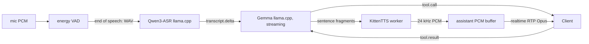

# Go Mode Local Voice Stack

The `local-stack` backend serves the unchanged
[voice gateway contract](VOICE_GATEWAY.md) with local ASR, LLM, and TTS. It is
half-duplex and needs no API key. It runs on macOS or Linux; macOS is the first
target. Target-Mac validation is phase `local-voice-quality` of
[PLAN_GOMODE.md](PLAN_GOMODE.md).

## Turn Flow



- ASR is final-only. After VAD end-of-speech, the adapter sends one in-memory
  WAV through `genai.Provider.GenSync` and emits one user transcript delta.
- Every LLM turn, including continuations after tool results, keeps tools
  available. `genai.Provider.GenStream` deltas go to TTS as stable sentence
  fragments. The final result drives history and tool calls.
- The fragmenter keeps text order, emits on stable punctuation or a size limit,
  and holds trailing text until the next boundary or the final flush.
- KittenTTS takes one request per fragment and streams PCM for each. Its
  24 kHz mono S16LE output needs no resampling.
- Barge-in cancels the active turn and clears buffered assistant audio.
- The bridge drains assistant PCM at realtime from an unbounded buffer, so TTS
  can queue audio ahead of playback.
- Logs report TTS first audio per fragment, buffer depth, and first assistant
  RTP latency. Runtime readiness is logged separately; latency figures exclude
  setup.

Partial ASR waits for a protocol flag that marks transcript deltas provisional
or final, and for a runtime with useful partial results.

## Configuration

```toml
backend = "local-stack"

# Omit these tables to let the gateway download and run its own llama.cpp
# servers. Set remote only when you run llama-server yourself, for example
# with custom flags, caches, thread counts, or builds.
# [local_stack.asr]
# provider = "llamacpp"
# remote = "http://localhost:8090"
# model = "ggml-org/Qwen3-ASR-0.6B-GGUF:Q8_0"

# [local_stack.llm]
# provider = "llamacpp"
# remote = "http://localhost:8080"
# model = "unsloth/gemma-4-E2B-it-GGUF:UD-Q4_K_XL"
```

ASR and LLM each run in their own managed llama.cpp server with independent
lifetimes. TTS has no config table: the gateway starts
`KittenML/kitten-tts-mini-0.8` through `uv` and Python 3.12.

## KittenTTS Runtime

- `uv --with` pins a Git revision. The published `kittentts-0.8.1` wheel does
  not match the worker API.
- Python 3.13 fails to build transitive dependencies; use 3.12.
- The dependency graph can pull large ML packages. KittenTTS stays an external
  process with its caches under the user cache directory, not vendored code.
- Cold setup is slow and variable, dominated by llama.cpp startup and cache
  state.
- Unauthenticated Hugging Face downloads work but warn about rate limits. Set
  `HF_TOKEN` for reliable cold setup.

## Smoke Test

```sh
go test -tags=smoke -run TestSmokeVoiceRTCLocalAudio -v -timeout 15m ./voicegateway/voicertc/
```

The test uses a fresh `XDG_CACHE_HOME`, so every run includes cold setup. It
checks TTS, ASR, LLM, managed tool calls, and full WebRTC turns. Linux CPU runs
prove wiring and audio-path correctness only; latency and quality need the
target Mac. Do not measure RSS.

## Alternatives

Evaluate these only if measured defaults fail on the target Mac:

- **ASR:** Parakeet through NeMo, `mudler/parakeet.cpp`, ONNX, or whisper.cpp
  (v1.9.0 adds `examples/parakeet-cli`); whisper.cpp also as a latency
  baseline. Gemma audio input is a non-target fallback.
- **LLM:** MLX, or an OpenAI-compatible server such as vLLM or SGLang.
- **TTS:** Qwen3-TTS through Python or ONNX. Hosted DashScope Qwen TTS only
  validates the protocol.

## Open Decisions

- Target Mac model and RAM.
- Minimum Linux runtime profile.
- Whether Parakeet reaches acceptable latency on macOS without CUDA.
- Whether Android and the browser share one SKILL.md parser or test separate
  ones against the same golden files.
- Whether browser voice stays a product feature or becomes a debug path.
- How a host advertises and selects among gateway URLs, one per backend.
